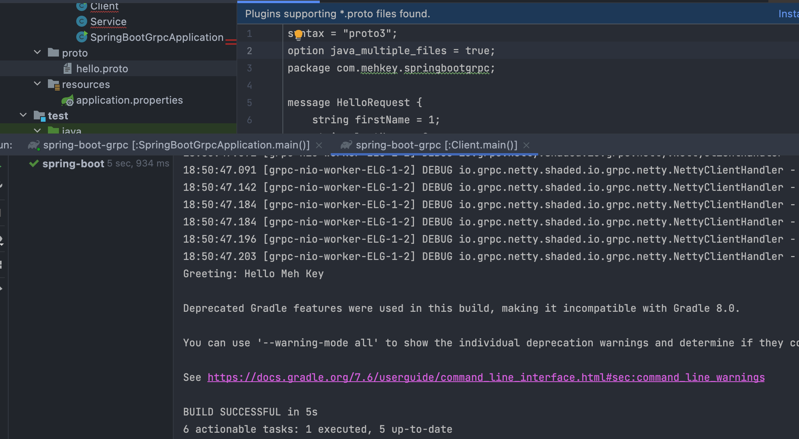

# spring-boot-grpc

 A spring boot grpc demo project in Java

```proto
syntax = "proto3";
option java_multiple_files = true;
package com.mehkey.springbootgrpc;

message HelloRequest {
    string firstName = 1;
    string lastName = 2;
}

message HelloResponse {
    string greeting = 1;
}

service HelloService {
    rpc hello(HelloRequest) returns (HelloResponse);
}

```


## Usage

```java

        ManagedChannel channel = ManagedChannelBuilder.forAddress("localhost", 6565).usePlaintext().build();

        HelloServiceBlockingStub stub = HelloServiceGrpc.newBlockingStub(channel);
        HelloResponse helloResponse = stub.hello(HelloRequest.newBuilder().setFirstName("Meh").setLastName("Key").build());
        System.out.println("Greeting: " + helloResponse.getGreeting());

```

## Service Example

```java
@GRpcService
public class Service  extends HelloServiceGrpc.HelloServiceImplBase {
    @Override
    public void hello(HelloRequest request,
                      StreamObserver<HelloResponse> responseObserver) {
        String message = "Hello " + request.getFirstName() + " " + request.getLastName();

        responseObserver.onNext(HelloResponse.newBuilder()
                .setGreeting(message)
                .build());
        responseObserver.onCompleted();
        System.out.println("HelloService: response message: " + message);
    }
}
```


## Commands

`gradlew build`


